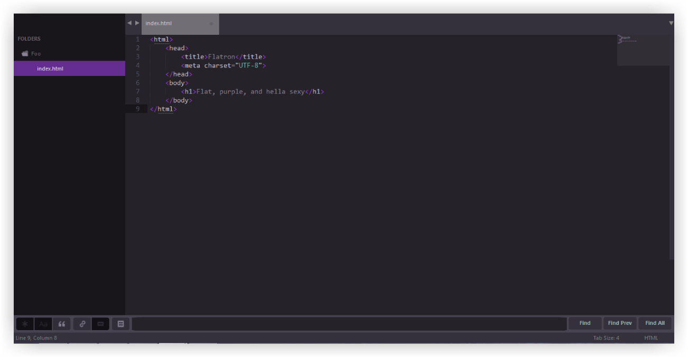

Flatron
=======

Flatron is a minimalist Sublime Text 3 theme. It's flat, purple, and hella sexy. Done in collaboration with [Cosmin Negoita](https://twitter.com/csmnng).



Installing
---

Looking to install Flatron? You, good person, have a handsome taste in text editor themes.

#### Package Manager
The easiest way to install is using [Sublime Package Control](https://sublime.wbond.net), where Flatron is listed.

1. Open Command Palette using menu item `Tools -> Command Palette...` (<kbd>⇧</kbd><kbd>⌘</kbd><kbd>P</kbd> on Mac)
2. Choose `Package Control: Install Package`
3. Find `Flatron` and hit <kbd>Enter</kbd>

#### Auto-Installer (Mac)
  > **Important Note:** If you are *not* on a Mac, the installer script won't work!
  
  1. Execute this command in your terminal:
    - `curl -s https://raw.githubusercontent.com/NoahBuscher/Flatron/master/install-sl3.sh | bash`

#### Manual Installation (Windows and Linux)

  1. Download the [latest release](https://github.com/Codingbean/Flatron/releases)
  2. Unzip the files and rename the folder to `Flatron`; be sure to include the spaces
  3. Find your Packages directory using the menu item `Preferences -> Browse Packages`
  4. Copy the folder into your Sublime Text `Packages` directory
  
Activating
---

You can then activate the UI theme and color scheme by modifying your user preferences file, which you can find using the menu item `Sublime Text -> Preferences -> Settings - User` (<kbd>⌘</kbd><kbd>,</kbd> on Mac).

***Note: Don't forget to restart Sublime Text after activating the theme.***

```json
{
  "color_scheme": "Packages/Flatron/Flatron.tmTheme",
  "theme": "Flatron.sublime-theme"
}
```

Yay! Flatron is now installed! :tada:
